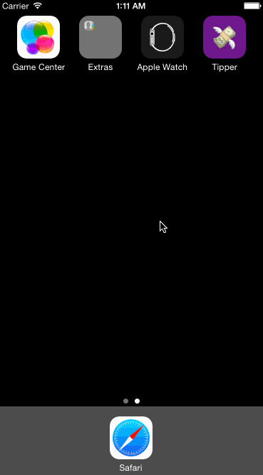

# Tip Calculator

This is an app for calculating tips.

Time spent: ~8 hours spent in total

Completed user stories:

 * [x] Required: User can enter in their bill amount
 * [x] Required: User can calculate a tip based on multiple percentage values
 * [x] Optional: Bill splitting
 * [x] Optional: Custom font
 * [x] Optional: Input formatting
 * [x] Optional: Animations
 * [x] Optional: Emoji
 
Notes:

N/A

Walkthrough of all user stories:

GIF created with [LiceCap](http://www.cockos.com/licecap/).